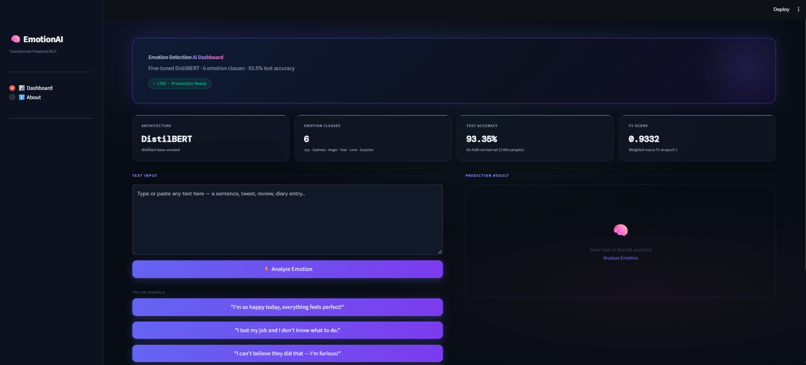

# 🧠 Emotion Detection from Text — End-to-End NLP Project

A complete NLP pipeline for classifying emotions in free-form text into **6 categories**: Joy, Sadness, Anger, Fear, Love, and Surprise. The project progresses from classical ML baselines through deep learning (RNN/LSTM/GRU) to a fine-tuned **DistilBERT** transformer, deployed as an interactive **Streamlit** dashboard.

---

[](https://emotion-detection-app-h8xquwqb3bq3bdkahzuqcn.streamlit.app/)

---

## 📸 Streamlit App Images



---

## 📁 Project Structure

```
emotion_detection/
├── code.ipynb            # Full experiment notebook (EDA → ML → DL → Transformer)
├── app.py                # Streamlit dashboard application
├── README.md
└── requirements.txt      # Python dependencies
```

---

## 📦 Dataset

| Property | Value |
|---|---|
| Source | [Kaggle — Emotions Dataset for NLP](https://www.kaggle.com/datasets/praveengovi/emotions-dataset-for-nlp) |
| License | CC-BY-SA-4.0 |
| Train set | 16,000 samples |
| Validation set | 2,000 samples |
| Test set | 2,000 samples |
| After deduplication (train) | **15,938 samples** |
| Format | `.txt` — semicolon-separated (text;emotion) |
| Classes | joy, sadness, anger, fear, love, surprise |

### Class Distribution (Training Set)

| Emotion | Count | Share |
|---|---|---|
| Joy | ~5,362 | ~33.6% |
| Sadness | ~4,666 | ~29.3% |
| Anger | ~2,159 | ~13.5% |
| Fear | ~1,937 | ~12.2% |
| Love | ~1,304 | ~8.2% |
| Surprise | ~510 | ~3.2% |

> **Note:** Dataset is moderately imbalanced — Joy and Sadness dominate; Surprise and Fear are underrepresented.

---

## 🔍 Exploratory Data Analysis (EDA)

### Key Findings

| Observation | Detail |
|---|---|
| Missing values | None detected across all splits |
| Duplicate conflicts | Duplicate texts with *conflicting* emotion labels detected and removed |
| Avg. text length | ~19 words / ~97 characters |
| Max text length | 66 words (no severe outliers) |
| Text length distribution | Positively skewed (right-skewed) |
| Vocabulary size | 15,197 unique words (before preprocessing) |
| Sentence count | Most samples are single-sentence — low variance feature |

### Word Length Statistics (Training Set)

| Metric | Characters | Words |
|---|---|---|
| Mean | ~97 | ~19 |
| Median | ~89 | ~17 |
| Max | ~296 | ~66 |
| Min | ~9 | ~2 |

### EDA Insights

- Most text samples are concise single sentences — ideal for sequence models with `maxlen ≈ 64`.
- Word cloud analysis confirmed distinct vocabulary per class (e.g., *lovely/adore* → love; *afraid/terror* → fear; *amazed* → surprise).
- Stopword removal + stemming is beneficial for classical ML (TF-IDF), but **not** recommended for deep learning models where context matters.
- Class imbalance is moderate; class-weight strategies or oversampling may help minority classes (surprise, fear).

---

## ⚙️ Preprocessing Pipelines

### Pipeline 1 — For Classical ML (TF-IDF)

Steps applied in order:

1. Lowercase conversion
2. HTML tag removal
3. URL removal
4. Emoji-to-text conversion
5. Chat word normalization (`u` → `you`, `lol` → `laugh`, etc.)
6. Special character / punctuation removal
7. Stopword removal *(negation words retained: not, no, nor, never)*
8. Porter Stemming

### Pipeline 2 — For Deep Learning (Keras RNN/LSTM/GRU)

Steps applied in order:

1. Lowercase conversion
2. URL removal
3. Extra whitespace normalization
4. Keras `Tokenizer` (vocab size = 15,000)
5. Padding to `maxlen = 64` (post-padding, post-truncation)

### Pipeline 3 — For Transformer (DistilBERT)

1. URL removal
2. Extra whitespace normalization
3. HuggingFace `AutoTokenizer` (`distilbert-base-uncased`)
4. Padding to `max_length = 64`, truncation enabled
5. Label mapping: `{joy:0, sadness:1, anger:2, fear:3, love:4, surprise:5}`

---

## 🤖 Models & Results

### Phase 1 — Classical Machine Learning (TF-IDF + Sklearn)

Feature engineering: TF-IDF with `max_features=15000`, `ngram_range=(1,2)`, then stacked with engineered features (char count, word count).

#### Raw Baseline Results (sorted by Test Accuracy)

| Model | Train Accuracy | Test Accuracy | Test Precision | Test Recall | Test F1 |
|---|---|---|---|---|---|
| AdaBoostClassifier | 34.35% | 35.35% | 0.285 | 0.354 | 0.197 |
| MultinomialNB | 78.41% | 72.40% | 0.748 | 0.724 | 0.680 |
| KNeighborsClassifier | 83.48% | 72.55% | 0.748 | 0.726 | 0.726 |
| DecisionTreeClassifier | 99.95% | 78.75% | 0.804 | 0.788 | 0.793 |
| MLPClassifier | 99.95% | 80.25% | 0.804 | 0.803 | 0.803 |
| RandomForestClassifier | 99.95% | 83.70% | 0.849 | 0.837 | 0.840 |
| LogisticRegression | 91.23% | 84.60% | 0.865 | 0.846 | 0.851 |
| XGBClassifier | 94.59% | 85.65% | 0.859 | 0.857 | 0.857 |
| LinearSVC | 96.36% | 85.85% | 0.865 | 0.859 | 0.861 |
| **ExtraTreesClassifier** | **99.95%** | **86.30%** | **0.864** | **0.863** | **0.863** |

> **Best Classical ML Model:** ExtraTreesClassifier — **86.30% Test Accuracy**

#### After Hyperparameter Tuning (GridSearchCV — 5-fold CV)

| Model | Best CV Score | Best Parameters |
|---|---|---|
| LogisticRegression | ~86% | `C=10, solver=lbfgs` |
| LinearSVC | ~87% | `C=1.0` |
| DecisionTreeClassifier | ~81% | `max_depth=20` |
| RandomForestClassifier | ~86% | `n_estimators=200` |
| MultinomialNB | ~74% | `alpha=0.1` |
| KNeighborsClassifier | ~75% | `n_neighbors=7` |
| ExtraTreesClassifier | ~87% | `n_estimators=200` |
| XGBClassifier | ~86% | `learning_rate=0.1, max_depth=6` |

---

### Phase 2 — Deep Learning (Keras Embedding + RNN/LSTM/GRU)

**Configuration:**
- Vocab size: 15,000
- Embedding dim: 64
- Max sequence length: 64
- Optimizer: Adam
- Loss: Sparse Categorical Crossentropy
- Early Stopping: patience = 3 (on val_loss)
- Max epochs: 10

#### Deep Learning Results (sorted by F1 Score)

| Model | Test Accuracy | Test Precision | Test Recall | Test F1 |
|---|---|---|---|---|
| **Bidirectional GRU** | **91.60%** | **0.9164** | **0.9160** | **0.9160** |
| Bidirectional LSTM | 90.10% | 0.9048 | 0.9010 | 0.9022 |
| Bidirectional Simple RNN | 83.15% | 0.8286 | 0.8315 | 0.8282 |
| Simple RNN | 34.75% | 0.1208 | 0.3475 | 0.1792 |
| LSTM | 34.75% | 0.1208 | 0.3475 | 0.1792 |
| GRU | 34.75% | 0.1208 | 0.3475 | 0.1792 |
| Stacked Simple RNN | 34.75% | 0.1208 | 0.3475 | 0.1792 |
| Stacked LSTM | 34.75% | 0.1208 | 0.3475 | 0.1792 |
| Stacked GRU | 34.75% | 0.1208 | 0.3475 | 0.1792 |

> **Best Deep Learning Model:** Bidirectional GRU — **91.60% Test Accuracy, F1 = 0.916**

> **Note:** Unidirectional and stacked variants (Simple RNN, LSTM, GRU, Stacked variants) collapsed to ~34.75% accuracy, likely due to vanishing gradient issues without bidirectional context. Bidirectional wrappers resolved this significantly.

---

### Phase 3 — Transformer Fine-Tuning (DistilBERT)

**Configuration:**

| Parameter | Value |
|---|---|
| Base model | `distilbert-base-uncased` |
| Num labels | 6 |
| Num epochs | 3 |
| Batch size (train) | 16 |
| Batch size (eval) | 16 |
| Eval strategy | Per epoch |
| Optimizer | AdamW (default Trainer) |
| Max token length | 64 |
| Training samples | 15,938 |
| Total training steps | 2,991 |
| Total training time | ~76 minutes (CPU) |

#### DistilBERT Training Progress (Validation Set)

| Epoch | Training Loss | Val Loss | Val Accuracy | Val Precision | Val Recall | Val F1 |
|---|---|---|---|---|---|---|
| 1 | 0.5468 | 0.1512 | **93.95%** | 0.9401 | 0.9395 | 0.9387 |
| 2 | 0.1478 | 0.1529 | 93.70% | 0.9389 | 0.9370 | 0.9362 |
| 3 | 0.0856 | 0.1621 | 93.85% | 0.9387 | 0.9385 | 0.9384 |

#### DistilBERT Final Test Set Evaluation

| Metric | Value |
|---|---|
| Test Loss | 0.1888 |
| **Test Accuracy** | **93.35%** |
| Test Precision | 0.9342 |
| Test Recall | 0.9335 |
| **Test F1** | **0.9332** |

---

## 📊 Model Comparison Summary

| Phase | Best Model | Test Accuracy | Test F1 |
|---|---|---|---|
| Classical ML | ExtraTreesClassifier | 86.30% | 0.863 |
| Deep Learning | Bidirectional GRU | 91.60% | 0.916 |
| **Transformer** | **DistilBERT (fine-tuned)** | **93.35%** | **0.933** |

> ✅ **DistilBERT achieves the best performance** — a **+7.05%** improvement over the best classical ML model and a **+1.75%** improvement over the best deep learning model.

---

## 🚀 Running the App

### 1. Install Dependencies

```bash
pip install streamlit transformers torch pandas plotly gdown
```

### 2. Run the Dashboard

```bash
streamlit run app.py
```

The app will automatically download the fine-tuned model from Google Drive on first launch.

### 3. Using the Dashboard

- Navigate to **Dashboard** → type or paste any text → click **Analyze Emotion**
- Check **Analytics** tab for session-level prediction history and distribution charts
- Use **About** tab for project details and architecture info

---

## 🛠️ Tech Stack

| Component | Library / Tool |
|---|---|
| Language | Python 3.10 |
| NLP / Transformer | Hugging Face Transformers, PyTorch |
| Classical ML | scikit-learn, XGBoost |
| Deep Learning | TensorFlow / Keras |
| Data Processing | Pandas, NumPy, NLTK |
| Visualization | Matplotlib, Seaborn, Plotly, WordCloud |
| Dashboard | Streamlit |
| Model Storage | Google Drive + gdown |
| Dataset | Kaggle API |

---

## 📌 Key Takeaways

1. **Bidirectional wrappers are essential** for RNN-family models — unidirectional variants collapsed to near-random performance on this dataset.
2. **TF-IDF + ExtraTrees** is a strong, fast baseline at 86.3% — good for production when latency matters more than accuracy.
3. **DistilBERT** achieves the best overall results (93.35%) with relatively short fine-tuning (3 epochs, ~76 min on CPU).
4. **Class imbalance** (surprise: ~3.2%, fear: ~12.2%) causes these minority classes to have lower per-class F1 — worth addressing in future work with oversampling or focal loss.
5. **Preprocessing strategy must match the model**: aggressive stemming helps TF-IDF but hurts deep/transformer models.

---

*Built with ❤️ using Streamlit, Hugging Face Transformers, and Plotly*
